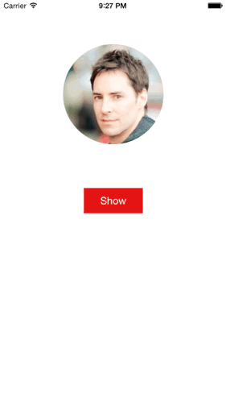

LECropPictureViewController
===========

## What is this

Want a nice crop editor for your picture? Not satisfied with the one provided for Apple? Likes rounded images?
`LECropPictureViewController` is the component for you :)! See the how works in the gif below:

<p align="center">

</p>

## Install

#### Manually

Drag and copy all files in the [__LECropPictureViewController__](Pod/Classes) folder into your project, or add it as a git submodule.

#### Cocoapods

LECropPictureViewController is available through [CocoaPods](http://cocoapods.org). To install
it, simply add the following line to your Podfile:

```ruby
pod "LECropPictureViewController"
```

## How to use

`LECropPictureViewController` works with any image. You just have to provide the image and a cropType when creating a new instance, and then present the view controller. The possible cropTypes are:

* `LECropPictureTypeRounded` 
* `LECropPictureTypeRect`

```objective-c
#import "LECropPictureViewController.h"

LECropPictureViewController *cropPictureController = [[LECropPictureViewController alloc] initWithImage:image andCropPictureType:LECropPictureTypeRounded];
[self presentViewController:cropPictureController animated:YES completion:nil];
```

The callback for the cropped picture is given through a block. See the exemple below, presenting the `LECropPictureViewController` inside the delegate of a UIImagePickerController:


```objective-c
-(void)imagePickerController:(UIImagePickerController *)picker didFinishPickingMediaWithInfo:(NSDictionary *)info
    {
    UIImage *image = info[UIImagePickerControllerOriginalImage];

    [self dismissViewControllerAnimated:NO completion:nil];

    LECropPictureViewController *cropPictureController = [[LECropPictureViewController alloc] initWithImage:image andCropPictureType:LECropPictureTypeRounded];
    cropPictureController.imageView.contentMode = UIViewContentModeScaleAspectFit;

    cropPictureController.photoAcceptedBlock = ^(UIImage *croppedPicture){
        self.imageView.image = croppedPicture;
    };

    [self presentViewController:cropPictureController animated:NO completion:nil];
}
```

## Customizing

The `LECropPictureViewController` has public properties for it's components. With this, you can do things like changing the **contentMode** of the imageView, changing the **text** of the barButtonItems, etc.

```objective-c
@property (weak, nonatomic) UIBarButtonItem *cancelButtonItem;
@property (weak, nonatomic) UIBarButtonItem *acceptButtonItem;
@property (weak, nonatomic) UIImageView *imageView;
```


Besides the subviews, you can customize other things like the initial frame of the crop area, borderColor and borderWidth, like below:

```objective-c
(...)
LECropPictureViewController *cropPictureController = [[LECropPictureViewController alloc] initWithImage:image andCropPictureType:LECropPictureTypeRounded];
cropPictureController.cropFrame = CGRectMake(50, 50, 250, 250);
cropPictureController.borderColor = [UIColor grayColor];
cropPictureController.borderWidth = 1.0;
(...)
```

You can even implement the ```@property(copy) void(^photoRejectedBlock)();```, if you want to override the default behaviour of the cancel button (which only dismiss the controller). Be aware that, if you do this, you will be responsible to dismiss the controller yourself.

```objective-c
cropPictureController.photoRejectedBlock = ^{
    NSLog(@"Doing something here!");
    [self dismissViewControllerAnimated:YES completion:nil];
};
```


## Collaborate
Liked the project? Is there something missing or that could be better? Feel free to contribute :)

1. Fork it

2. Create your branch
``` git checkout -b name-your-feature ```

3. Commit it
``` git commit -m 'the difference' ```

4. Push it
``` git push origin name-your-feature ```

5. Create a Pull Request


## Author

Lucas Eduardo, lucasecf@gmail.com

## License

LECropPictureViewController is available under the MIT license. See the LICENSE file for more info.
